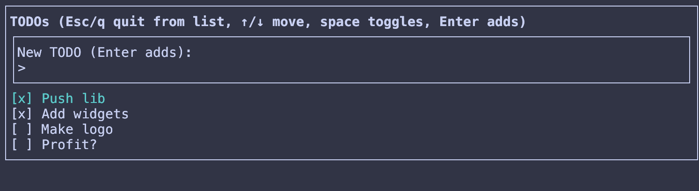

# cha-tui (茶tui)

A rust crate for creating terminal TUIs with modern features and layout. 

See also the main app developed using this [git_status](./crates/git_status)

## Features

- Elm style update loop
- Full mouse support
- Full flexbox/grid layout support using taffy
- Support for kitty keyboard protocol
- Efficient minimal updates to the backend terminal

The codebase is a hobby project with limited documentation.

The project is heavily inspired by my use and deep dive into the codebases of
- [helix](https://github.com/helix-editor/helix)
- [edit](https://github.com/microsoft/edit)

Both are amazing projects and I learned a lot from these. Special thanks to the
Helix team for my daily editor, and for making the tree-house and termina
crates. Both of which are heavily used in this project!

## Elm Architecture

Just like other Elm-style UIs there are 3 components to a program

```rust
// Program::new
pub fn new(
    model: Model,
    update: impl FnMut(&mut Model, Msg) -> Transition<Msg> + 'static,
    view: impl Fn(&Model) -> Node<Msg> + 'static,
) -> Self {
```

The `model` contains all the app state. `view` renders the model into a UI Tree.
The UI can have triggers like mouse clicks that create Msgs, these together
with outside updates (like keyboard or resizes) get fed into the update function!

## Example

See `crates/todo/src/main.rs`



snippet of the rendering code:

```rust
fn view(model: &Model) -> Node<Msg> {
    let header = text::<Msg>("TODOs (Esc/q quit from list, ↑/↓ move, space toggles, Enter adds)")
        .with_style(Style::bold());

    let items = model
        .items
        .iter()
        .enumerate()
        .map(|(index, item)| {
            let highlighted = model.focus == Focus::List && index == model.selected;
            render_item(item, highlighted)
        })
        .collect();

    column(vec![block(vec![column(vec![
        header,
        render_input(model),
        column(items),
    ])])])
    .with_fill()
}

fn render_item(item: &Item, highlighted: bool) -> Node<Msg> {
    let marker = if item.completed { "[x]" } else { "[ ]" };
    let text_node = text::<Msg>(format!("{} {}", marker, item.title));
    let styled_text = if highlighted {
        text_node.with_style(Style::fg(Color::Cyan))
    } else {
        text_node
    };

    row(vec![styled_text])
}
```
