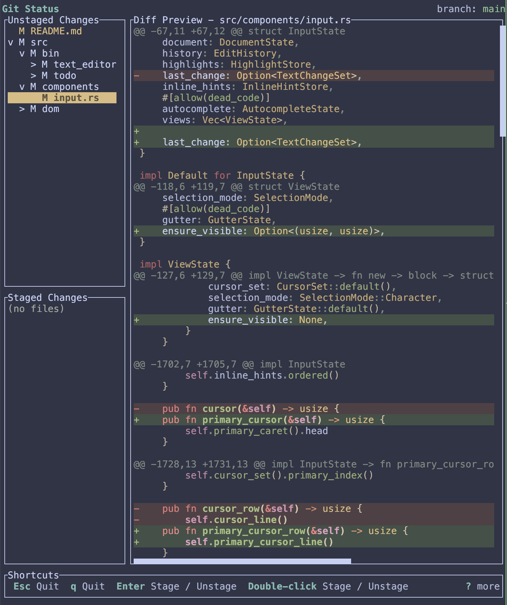

# git_status

A TUI app built using the tui framework. A replacement for (a small subset of)
lazygit.

Supports the basic git workflow: review, stage and commit.

## Extra Features Compared to Lazygit

- Full mouse support (shortcuts in the bottom panel can also be pressed to trigger the action)
- Full treesitter highlighting of code

The project works well and I'm using it as a daily driver for my git usage
together with command line git where it's lacking.
